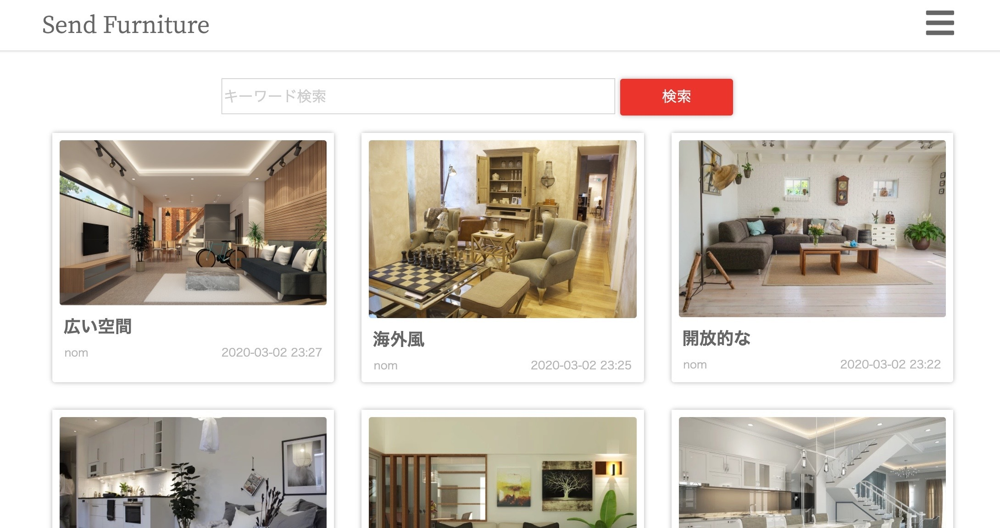

Name
====
Send Furniture

# 概要
インテリア共有SNSです。
自分の部屋や、家具の写真を投稿し、その投稿に対してコメントなどで交流できます。

# 開発環境
- Ruby on Rails
- jQuery
- VSCode（Visual Studio Code）
- heroku
- Google Chrome

# アプリの機能
1. 投稿機能

2. タグ登録機能
3. コメント機能
4. 投稿検索機能
5. レスポンシブデザイン
